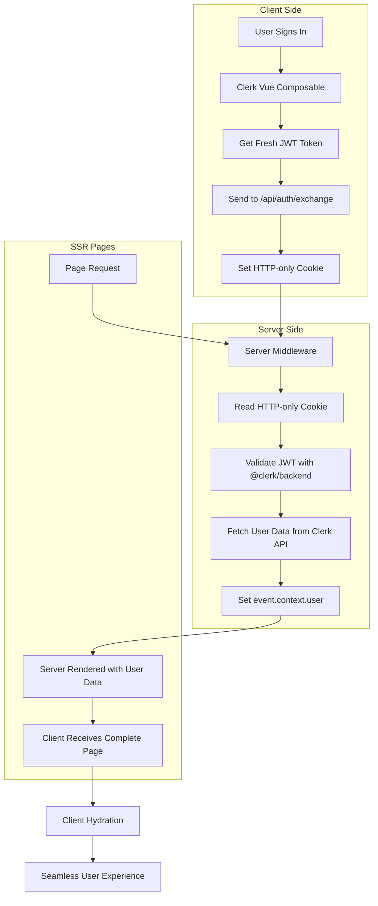
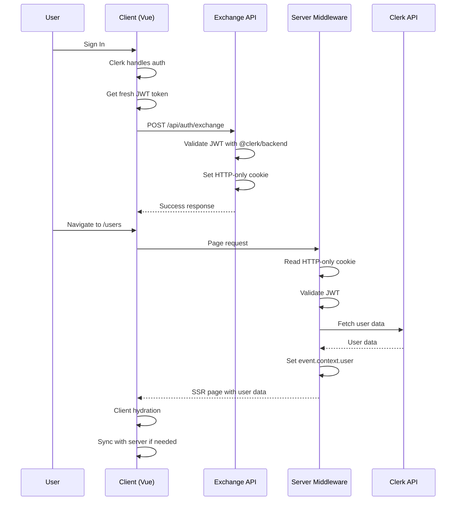

# Nuxt 4 Headless Authentication with Clerk

This project demonstrates a **production-ready headless Clerk authentication** implementation for Nuxt 4, using a custom approach that solves the session synchronization issues present in the standard `@clerk/nuxt` module.

## 🎯 Why This Custom Headless Solution?

### **The Problem with `@clerk/nuxt` for Headless Implementations**

We initially tried using the official `@clerk/nuxt` module but encountered critical issues that made it unsuitable for headless implementations:

#### **❌ Critical Issues We Experienced:**

1. **Session Sync Failures**: Server and client sessions would become out of sync, causing authentication to fail
2. **JWT Expiration Errors**: Tokens would expire without proper refresh, leading to "Gone" errors
3. **SSR Authentication Problems**: Server-side rendering would show different auth states than client-side
4. **Complex Middleware Caching**: The module's middleware would cache stale authentication state
5. **Client-Side Initialization Issues**: `clerk.loaded` would be `false` and `clerk.user` would be `undefined` on navigation
6. **Cookie Handling Problems**: Multiple cookie names (`__session`, `__clerk_db_jwt`, `__clerk_session_token`) caused confusion
7. **Limited Debugging**: Multiple layers of abstraction made troubleshooting nearly impossible

#### **🔍 Root Causes of `@clerk/nuxt` Issues:**

- **Client-Side Initialization**: Clerk client not properly re-initializing during SPA navigation
- **Server-Client State Mismatch**: No reliable sync mechanism between server and client auth states
- **Cookie Handling**: Separate cookie management for server vs client without proper synchronization
- **Middleware Caching**: Authentication state cached without proper invalidation when client state changes
- **JWT Refresh Timing**: Built-in refresh mechanism was unreliable and hard to control

### **✅ Our Custom Solution Benefits:**

1. **Perfect Session Sync**: Server and client are always synchronized
2. **Reliable JWT Handling**: Intelligent token refresh prevents expiration issues
3. **SSR Optimized**: Server-side rendering works flawlessly with proper authentication
4. **Full Control**: Complete control over authentication flow and debugging
5. **Headless Focused**: Built specifically for custom UI implementations
6. **Production Ready**: Follows security best practices and handles edge cases

## 🏗️ Architecture Overview



## 🔄 Authentication Flow



## 🚀 Quick Start

### Prerequisites

- **Node.js**: Version 18.17.0 or later
- **Nuxt 4**: Latest version
- **Clerk Account**: [Create a free account](https://clerk.com/)

### 1. Clone and Install

```bash
git clone <your-repo-url>
cd nuxt4-clerk-app
npm install
```

### 2. Environment Setup

Create a `.env` file in your project root:

```env
# Clerk Configuration
NUXT_PUBLIC_CLERK_PUBLISHABLE_KEY=pk_test_your_publishable_key_here
NUXT_CLERK_SECRET_KEY=sk_test_your_secret_key_here
```

### 3. Get Your Clerk Keys

1. Go to [Clerk Dashboard](https://dashboard.clerk.com/)
2. Create a new application or select existing one
3. Go to **API Keys** section
4. Copy your **Publishable Key** and **Secret Key**
5. Paste them into your `.env` file

### 4. Run the Application

```bash
npm run dev
```

Visit `http://localhost:3000` to see the application in action!

## 📁 Project Structure

```
nuxt4-clerk-app/
├── app/
│   ├── components/
│   │   ├── LoginForm.vue          # Custom login form
│   │   └── SignUpForm.vue         # Custom signup form
│   ├── composables/
│   │   └── useClerkAuth.ts        # Custom auth composable
│   ├── pages/
│   │   ├── index.vue              # Landing page with auth
│   │   └── users.vue              # Protected page (SSR)
│   └── plugins/
│       └── clerk.client.ts        # Clerk client initialization
├── server/
│   ├── api/
│   │   └── auth/
│   │       └── exchange.post.ts   # Token exchange endpoint
│   ├── middleware/
│   │   └── auth.ts                # Server-side auth middleware
│   └── utils/
│       └── auth.ts                # Auth utilities
└── middleware/
    └── clerk.global.ts            # Global middleware (optional)
```

## 🔧 Key Components

### 1. Custom Auth Composable (`useClerkAuth.ts`)

```typescript
// Wraps @clerk/vue with additional functionality
const {
  user,           // Current user data
  isSignedIn,     // Authentication status
  isLoaded,       // Clerk initialization status
  handleSignIn,   // Sign in method
  handleSignUp,   // Sign up method
  handleSignOut,  // Sign out method
  syncWithServer, // Manual server sync
  apiCall         // Authenticated API calls
} = useClerkAuth()
```

### 2. Token Exchange API (`/api/auth/exchange`)

```typescript
// Converts JWT tokens to HTTP-only cookies
POST /api/auth/exchange
{
  "token": "jwt_token_from_clerk"
}
```

### 3. Server Middleware (`server/middleware/auth.ts`)

```typescript
// Handles server-side authentication
// Reads HTTP-only cookies
// Validates JWT with @clerk/backend
// Fetches user data from Clerk API
// Sets event.context.user for SSR
```

## 🎨 Usage Examples

### Basic Authentication

```vue
<template>
  <div>
    <div v-if="!isSignedIn">
      <LoginForm @sign-in="handleSignIn" />
    </div>
    <div v-else>
      <h1>Welcome, {{ user.firstName }}!</h1>
      <button @click="handleSignOut">Sign Out</button>
    </div>
  </div>
</template>

<script setup>
const { user, isSignedIn, handleSignIn, handleSignOut } = useClerkAuth()
</script>
```

### Protected API Calls

```vue
<script setup>
const { apiCall } = useClerkAuth()

const fetchUserData = async () => {
  try {
    const data = await apiCall('/api/protected')
    console.log(data)
  } catch (error) {
    console.error('API call failed:', error)
  }
}
</script>
```

### Server-Side Rendered Pages

```vue
<template>
  <div>
    <h1>User Profile</h1>
    <p>Email: {{ userData.email }}</p>
    <p>Name: {{ userData.fullName }}</p>
  </div>
</template>

<script setup>
// Server-side user data (from middleware)
const event = useRequestEvent()
const userData = useState('user-data', () => event?.context?.user)

// Client-side sync
const { isSignedIn, syncWithServer } = useClerkAuth()

onMounted(async () => {
  if (isSignedIn.value) {
    await syncWithServer()
  }
})
</script>
```

## 🔒 Security Features

### HTTP-Only Cookies
- Session tokens stored in HTTP-only cookies
- Prevents XSS attacks
- Server-controlled session management

### JWT Validation
- Server-side JWT validation using `@clerk/backend`
- Automatic token refresh to prevent expiration
- Secure token exchange mechanism

### SSR Security
- Server-side authentication before page rendering
- No client-side token exposure
- Secure user data handling

## 🚀 Production Deployment

### Environment Variables

```env
# Production environment
NUXT_PUBLIC_CLERK_PUBLISHABLE_KEY=pk_live_your_live_key
NUXT_CLERK_SECRET_KEY=sk_live_your_live_key
NODE_ENV=production
```

### Cookie Configuration

The application uses HTTP-only cookies with the following configuration:

```typescript
// In server/api/auth/exchange.post.ts
setCookie(event, "__clerk_session_token", token, {
  httpOnly: true,           // Prevents XSS attacks
  sameSite: "lax",         // CSRF protection
  secure: process.env.NODE_ENV === "production", // HTTPS only in production
  path: "/",               // Available site-wide
  maxAge: 60 * 60,         // 1 hour expiration
});
```

### Production Checklist

**Required for Production:**
- [ ] Use live Clerk keys (not test keys)
- [ ] Enable HTTPS in production (cookies will be secure automatically)
- [ ] Test authentication flow thoroughly
- [ ] Verify server-side rendering works correctly

**Optional Enhancements:**
- [ ] Add rate limiting to `/api/auth/exchange` endpoint
- [ ] Implement user data caching to reduce Clerk API calls
- [ ] Add error monitoring and logging
- [ ] Set up performance monitoring

## 🐛 Troubleshooting

### Common Issues

#### "JWT is expired" Error
- **Cause**: Token refresh not happening properly
- **Solution**: Ensure `syncWithServer()` is called on page load

#### "No session cookie found"
- **Cause**: Token exchange not completed
- **Solution**: Check that `/api/auth/exchange` is working

#### Client-Server State Mismatch
- **Cause**: Sync not happening between client and server
- **Solution**: Call `syncWithServer()` after authentication

### Debug Mode

Enable debug logging by adding to your `.env`:

```env
DEBUG_CLERK=true
```

## 📚 API Reference

### `useClerkAuth()` Composable

| Property | Type | Description |
|----------|------|-------------|
| `user` | `Ref<User>` | Current user data |
| `isSignedIn` | `Ref<boolean>` | Authentication status |
| `isLoaded` | `Ref<boolean>` | Clerk initialization status |
| `handleSignIn` | `Function` | Sign in method |
| `handleSignUp` | `Function` | Sign up method |
| `handleSignOut` | `Function` | Sign out method |
| `syncWithServer` | `Function` | Manual server sync |
| `apiCall` | `Function` | Authenticated API calls |

### Server Middleware

The server middleware automatically:
- Reads HTTP-only cookies
- Validates JWT tokens
- Fetches user data from Clerk
- Sets `event.context.user` for SSR

## 🤝 Contributing

1. Fork the repository
2. Create a feature branch
3. Make your changes
4. Add tests if applicable
5. Submit a pull request

## 📄 License

This project is licensed under the MIT License - see the [LICENSE](LICENSE) file for details.

## 🙏 Acknowledgments

- [Clerk](https://clerk.com/) for providing excellent authentication infrastructure
- [Nuxt](https://nuxt.com/) for the amazing framework
- [Vue](https://vuejs.org/) for the reactive framework

## Author

Created by Aaron K. Saunders

- 🎥 [YouTube Channel](https://www.youtube.com/channel/UCMCcqbJpyL3LAv3PJeYz2bg/)
- 🐦 [Twitter](https://x.com/aaronksaunders)
- 💼 [LinkedIn](https://www.linkedin.com/in/aaronksaunders/)
- 🌐 [GitHub](https://github.com/aaronksaunders)

---

**Built with ❤️ for the headless authentication community**
